<div align="center">

<a href="https://kncn23.github.io/#projects"></a>

[](https://github.com/KNCn23/mini-rtos)

[](https://kncn23.github.io)

</div>

A small AArch64 real-time operating system built on top of the [mini-arm-os](https://github.com/KNCn23/mini-arm-os) foundation. Adds **task switching, schedulers, and synchronization primitives** — the missing pieces between a bare-metal kernel and a usable embedded runtime.

## What's new vs mini-arm-os

| Subsystem | Mini-arm-os | Mini-rtos |
|---|---|---|
| Boot + UART + heap | ✅ | ✅ |
| Interactive shell  | ✅ | — |
| **Task switching** (callee-saved reg save/restore) | — | ✅ |
| **Round-robin scheduler** | — | ✅ |
| **Priority scheduler** | — | ✅ |
| **Cooperative `yield()`** | — | ✅ |
| **`sleep_ms()`** (timed blocking) | — | ✅ |
| **Preemptive tick** via system counter | — | ✅ |
| **Counting semaphores** with FIFO waiter queue | — | ✅ |

## Architecture

```
mini-rtos/
├── boot/startup.S           # _start: stack + bss + → kmain
├── kernel/
│   ├── kernel.c             # demo: 3 tasks sharing a UART semaphore
│   ├── task.[ch]            # Task + Context structs, static stacks
│   ├── sched.[ch]           # RR / priority pickers, context_switch glue
│   ├── context_switch.S     # 13-reg save/restore in pure assembly
│   └── sync.[ch]            # Counting semaphore with up to 8 waiters
├── drivers/
│   ├── uart.[ch]            # PL011 PL011 console
│   └── timer.[ch]           # CNTPCT_EL0 → tick events
├── include/types.h
└── linker.ld
```

## Context switch

`context_switch.S` is the heart of the kernel. It saves the AArch64 ABI's callee-saved registers (x19–x28, fp, lr) plus `sp` into the outgoing task's `Context`, then loads them from the incoming task and returns. Because we restore `lr`, the first time a task runs it returns straight into its entry function.

```asm
context_switch:
    stp x19, x20, [x0,  #0]    // save 13 regs
    ...
    ldp x19, x20, [x1,  #0]    // restore from new task
    ...
    ret                         // returns into new task's lr
```

## Build & run

```bash
brew install qemu aarch64-unknown-linux-gnu     # macOS
# or: sudo apt install qemu-system-arm gcc-aarch64-linux-gnu   (Linux)
./run.sh
```

You should see three tasks interleaving:

```
mini-rtos — AArch64 cooperative+preemptive kernel
══════════════════════════════════════════════════
[boot] 3 tasks created — starting scheduler

  [blinker] tick #1
  [counter] reached 100000
  [blinker] tick #2
  [counter] reached 200000
  ...

── Task table ──
ID  Name        Prio  State    Ticks
0   blinker     2     BLOCKED  14
1   counter     3     READY    62
2   monitor     1     RUNNING  3
```

Exit QEMU with `Ctrl-A` then `x`.

## Switching the scheduler policy

In `kmain()`:

```c
sched_init(SCHED_ROUND_ROBIN);   // round-robin
sched_init(SCHED_PRIORITY);      // priority (lower number = higher priority)
```

## License

MIT
